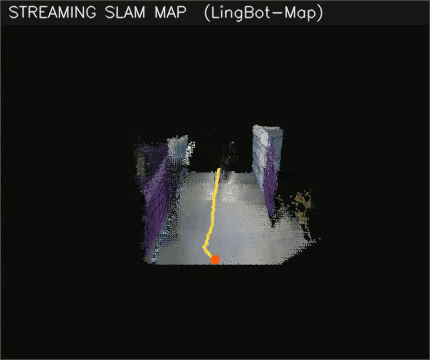
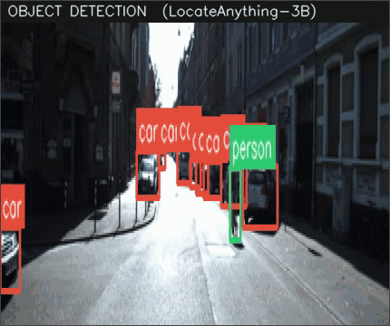

<h1 align="center">CogniNav</h1>

<p align="center">
  <b>GPU-accelerated scene understanding for vehicles and warehouse robots.</b><br>
  Streaming neural SLAM + drivable-path detection + open-vocabulary object detection,<br>
  fused into one real-time navigation dashboard.
</p>

<p align="center">
  
  
  
  
</p>

---

## Demo

**Road (KITTI city drive)** — SLAM map, path overlay, and car/person detection running together:


**Warehouse (NVIDIA r2b_storage)** — the same pipeline in aisle-following mode:


Full-resolution videos: [`assets/demo_road.mp4`](assets/demo_road.mp4) · [`assets/demo_warehouse.mp4`](assets/demo_warehouse.mp4)

| Streaming SLAM map | Object detection (cars + humans) |
|:---:|:---:|
|  |  |

**Path / lane detection overlay** — corridor polygon, boundary lines, and center-line guidance with lateral offset:


---

## What it does

CogniNav helps a vehicle or warehouse robot **understand the scene on the spot** from a single monocular camera, entirely on GPU:

1. **Streaming SLAM — [LingBot-Map](https://github.com/Robbyant/lingbot-map)**
   A feed-forward 3D foundation model (Geometric Context Transformer). Every frame produces camera pose, dense metric depth, and world points — no feature matching, no bundle adjustment, no initialization wait. The dashboard renders the accumulated point-cloud map with the live trajectory from a chase camera.

2. **Path / lane detection**
   A corridor extractor with temporal smoothing that overlays the drivable region:
   `--mode road` locks onto painted lane lines; `--mode warehouse` tracks aisle floor edges. It reports the robot's lateral offset from the corridor center each frame.

3. **Object detection — [LocateAnything-3B](https://huggingface.co/nvidia/LocateAnything-3B)**
   NVIDIA's open-vocabulary grounding VLM with Parallel Box Decoding. Cars and humans by default — but categories are plain text (`--categories "car,person,forklift"`), so the same model detects anything you can name, with no retraining.

All three run against the same frames and are composited into a single dashboard video with live FPS readouts.

### Measured on an RTX 5080 Laptop (16 GB)

| Stage | Model | Throughput |
|---|---|---|
| SLAM + depth | lingbot-map (SDPA backend) | ~6–11 FPS |
| Object detection | LocateAnything-3B (hybrid mode, bf16) | ~0.2–0.5 s / frame |
| Lanes + dashboard render | OpenCV | > 30 FPS |

FlashInfer (`pip install flashinfer-python`) raises SLAM throughput further (~20 FPS at 518 px per the upstream benchmark).

---

## Quick start

```bash
git clone https://github.com/<you>/CogniNav && cd CogniNav
./scripts/setup.sh          # venv + PyTorch cu128 + lingbot-map + model weights (~12 GB)

./scripts/run_road_demo.sh       # KITTI city drive (auto-downloads ~640 MB)
./scripts/run_warehouse_demo.sh  # NVIDIA r2b warehouse bag (auto-downloads ~2.9 GB)
```

Each demo writes a dashboard video to `outputs/<run>/cogninav_<mode>.mp4`.

### Run on your own footage

```bash
source .venv/bin/activate

# Any video
python -m cogninav.pipeline --video dashcam.mp4 --mode road --categories "car,person"

# Any image folder
python -m cogninav.pipeline --image_folder ./frames --mode road

# Any ROS 2 bag — decoded in pure Python, no ROS installation needed
python -m cogninav.pipeline --bag ./my_bag --bag_topic /camera/image_raw --mode warehouse
```

Useful flags:

| Flag | Default | Meaning |
|---|---|---|
| `--mode` | `road` | `road` (painted lanes) or `warehouse` (aisle edges) |
| `--categories` | `car,person` | Comma-separated open-vocabulary detection prompts |
| `--det_every` | `5` | Run the detector VLM every N frames (held between) |
| `--first_k` / `--stride` | — | Trim or subsample the input sequence |
| `--no_cache` | off | Recompute SLAM/detections instead of reusing `outputs/*` caches |

Stage results are cached (`slam.npz`, `detections.npz`), so re-rendering with different overlay settings is instant.

---

## Architecture

```
                      ┌────────────────────────────────────┐
 camera / video /     │            cogninav.pipeline       │
 ROS 2 bag ──frames──▶│                                    │
                      │  1. slam.py    LingBot-Map (GPU)   │──▶ poses, depth, world points
                      │  2. detect.py  LocateAnything-3B   │──▶ car / human boxes
                      │  3. lanes.py   corridor extractor  │──▶ drivable path + offset
                      │  4. viz.py     map render + panels │──▶ dashboard MP4
                      └────────────────────────────────────┘
```

```
CogniNav/
  cogninav/
    data.py       # frame sources: folders, videos, ROS 2 bags (rosbags, no ROS)
    slam.py       # LingBot-Map streaming inference + depth unprojection
    detect.py     # LocateAnything-3B worker + <ref>/<box> output parser
    lanes.py      # road / warehouse corridor detection with temporal smoothing
    viz.py        # NumPy point-cloud renderer + dashboard compositor
    pipeline.py   # end-to-end CLI
  scripts/        # setup.sh, run_road_demo.sh, run_warehouse_demo.sh
  assets/         # demo GIFs / MP4s shown above
  models/         # weights (downloaded by setup.sh, gitignored)
  third_party/    # lingbot-map clone (gitignored)
```

## Requirements

- NVIDIA GPU with ≥ 12 GB VRAM (tested: RTX 5080 Laptop 16 GB, CUDA 13.2 driver)
- Python 3.10, PyTorch 2.8.0 + cu128
- No ROS installation needed — bags are decoded with [rosbags](https://pypi.org/project/rosbags/)

## Licenses

- CogniNav code: MIT
- [LingBot-Map](https://github.com/Robbyant/lingbot-map): Apache-2.0
- [LocateAnything-3B](https://huggingface.co/nvidia/LocateAnything-3B): NVIDIA non-commercial research license — **commercial deployments must replace the detector** (the `ObjectDetector` interface makes it a drop-in swap)
- KITTI / r2b datasets: their respective terms

---

<p align="center">
  <sub>CogniNav — see the road, the path, and everything on it, in one pass.</sub>
</p>
