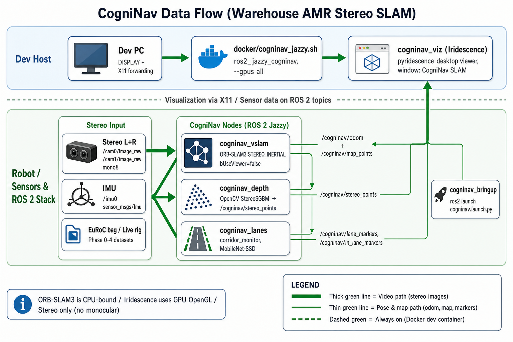

<p align="center">
  <strong style="font-size: 1.6em;">CogniNav</strong><br/>
  <em>Stereo visual SLAM and aisle guidance for warehouse AMRs</em>
</p>

<p align="center">
  <a href="https://github.com/jonathantyl97/CogniNav"></a>
  <a href="https://github.com/jonathantyl97/CogniNav"></a>
  <a href="https://github.com/jonathantyl97/CogniNav"></a>
  <a href="https://github.com/jonathantyl97/CogniNav"></a>
  <a href="https://github.com/jonathantyl97/CogniNav/blob/main/plan.md"></a>
</p>

---

**CogniNav** is a ROS 2 stack for autonomous mobile robots in **dynamic warehouses**: stereo ORB-SLAM3 localization, dense stereo depth, floor-line aisle detection, and in-corridor human/vehicle awareness. Visualization uses **[Iridescence](https://github.com/koide3/iridescence)** (desktop OpenGL), not Pangolin at runtime.

| Design choice | Policy |
|---------------|--------|
| Cameras | **Stereo pair only** (no monocular mode) |
| Primary ROS distro | **Jazzy** on Ubuntu 24.04 |
| SLAM core | [ORB-SLAM3](https://github.com/UZ-SLAMLab/ORB_SLAM3) (GPLv3), headless viewer |
| Dense depth | OpenCV `StereoSGBM` |
| Debug viewer | `cogninav_viz` + `pyridescence` |
| Benchmarks | **Warehouse bags** (TorWIC) + live rig regression |

---

## Architecture

<p align="center">
  
</p>

**Typical flow:** stereo images feed SLAM and perception; SLAM pose anchors lane geometry; depth and detections highlight obstacles and movers in the aisle; Iridescence shows map, trajectory, depth, and markers in one window.

---

## ROS 2 packages

| Package | Role |
|---------|------|
| `cogninav_vslam` | ORB-SLAM3 wrapper (`orb_slam3_stereo`, `orb_slam3_stereo_inertial`) |
| `cogninav_depth` | Dense `/cogninav/stereo_points` from rectified stereo |
| `cogninav_lanes` | Floor lines + MobileNet-SSD corridor monitor |
| `cogninav_viz` | Iridescence viewer for map, odom, depth, lanes, dynamics |
| `cogninav_bringup` | Launch files and YAML configs |

### Key topics

| Topic | Message |
|-------|---------|
| `/cogninav/odom` | `nav_msgs/Odometry` |
| `/cogninav/map_points` | `sensor_msgs/PointCloud2` |
| `/cogninav/stereo_points` | `sensor_msgs/PointCloud2` |
| `/cogninav/lane_markers` | `visualization_msgs/MarkerArray` |
| `/cogninav/in_lane_markers` | `visualization_msgs/MarkerArray` |

---

## Quick start

### 1. Start the dev container

```bash
./docker/cogninav_jazzy.sh
```

Mounts the repo at `/root/cogninav`, enables GPU + X11 for Iridescence, and uses a **persistent** container (`ros2_jazzy_cogninav`).

### 2. Install dependencies (first time)

```bash
cd /root/cogninav
./scripts/setup_deps.sh    # ORB-SLAM3, Pangolin (compile-only), pyridescence
```

### 3. Build the workspace

```bash
cd /root/cogninav/ros2_ws
source /opt/ros/jazzy/setup.bash
colcon build
source install/setup.bash
```

### 4. Launch (perception + viz)

```bash
ros2 launch cogninav_bringup cogninav.launch.py
# Headless (no Iridescence window):
ros2 launch cogninav_bringup cogninav.launch.py use_viz:=false
```

### 5. Warehouse datasets

Two ROS 2 warehouse bags are supported:

| Source | Scene | Download |
|--------|-------|----------|
| **TorWIC** | Real Clearpath warehouse (Azure Kinect stereo + IMU) | `./scripts/download_warehouse.sh --source torwic --seq aisle_cw_run_1` |
| **r2b_storage** | NVIDIA storage/warehouse (RealSense D455 IR + IMU, native ROS 2) | `./scripts/download_warehouse.sh --source r2b` |

```bash
# TorWIC (real warehouse)
./scripts/download_warehouse.sh --source torwic --seq aisle_cw_run_1
./benchmarks/run_warehouse_slam.sh --source torwic --seq aisle_cw_run_1
ros2 launch cogninav_bringup warehouse.launch.py

# NVIDIA r2b_storage (synthetic storage scene, ~2.9 GB)
./scripts/download_warehouse.sh --source r2b
./benchmarks/run_warehouse_slam.sh --source r2b
ros2 launch cogninav_bringup r2b_storage.launch.py
```

### 6. ROS 2 Humble parity (Phase 3)

```bash
./docker/cogninav_humble.sh          # first time: create container
./benchmarks/run_humble_smoke.sh --workspace-only
./benchmarks/run_humble_smoke.sh --seq aisle_cw_run_1
```

See `docker/HUMBLE.md` for Jazzy vs Humble ORB rebuild notes.

### 7. Live stereo rig (Phase 4)

```bash
# 1. Start camera driver (see docker/LIVE_RIG.md)
ros2 launch realsense2_camera rs_launch.py enable_infra1:=true enable_infra2:=true \
  enable_gyro:=true enable_accel:=true unite_imu_method:=2

# 2. CogniNav + Iridescence
./scripts/run_live_viz.sh --rig realsense_d455

# 3. Record warehouse bag
./scripts/record_rig_bag.sh --rig realsense_d455 --name warehouse_aisle1

# 4. Regression after calibration changes
./benchmarks/run_regression_suite.sh
```

### 8. Smoke test

```bash
./scripts/smoke_warehouse.sh --workspace-only
# TorWIC SLAM smoke:
./scripts/smoke_warehouse.sh --source torwic --seq aisle_cw_run_1
# r2b_storage SLAM smoke (smaller, native ROS 2):
./scripts/smoke_warehouse.sh --source r2b
```

---

## Repository layout

```
CogniNav/
  docker/              # Jazzy / Humble container scripts + Dockerfile
  scripts/             # setup_deps, warehouse download, smoke tests
  ros2_ws/src/         # ROS 2 packages
  benchmarks/          # eval harness + results/
  third_party/         # ORB_SLAM3 (cloned by setup_deps, not in git)
  plan.md              # Full roadmap and phase gates
```

---

## Roadmap

| Phase | Goal | Gate |
|-------|------|------|
| **0** | Docker + workspace + ORB build | `colcon build`, warehouse smoke |
| **1** | Warehouse SLAM + viz | TorWIC bag trajectory smoke |
| **2** | Perception stack on warehouse replay | Lanes + depth + dynamics on bag |
| **3** | Humble parity | Warehouse smoke in `ros2_humble_cogninav` |
| **4** | Live stereo rig + warehouse bag | Live SLAM + regression suite passes |

Details: [`plan.md`](plan.md)

---

## Development

| Item | Notes |
|------|-------|
| Wrapper source | Adapted from [zang09/ORB_SLAM3_ROS2](https://github.com/zang09/ORB_SLAM3_ROS2) |
| Jazzy patches | `scripts/patch_orb_jazzy.sh` (OpenCV 4.6, GCC 13, C++17) |
| Warehouse data | [TorWIC-SLAM](https://github.com/Viky397/TorWICDataset) (real), [NVIDIA r2b_storage](https://catalog.ngc.nvidia.com/orgs/nvidia/teams/isaac/resources/r2bdataset2023) (ROS 2 native) |
| Evaluation | [evo](https://github.com/MichaelGrupp/evo) via `benchmarks/run_benchmark.sh` |

---

## License

- CogniNav ROS 2 packages: see per-package `package.xml` (Apache-2.0 / MIT / GPL-3.0 where noted).
- **ORB-SLAM3** and the vendored wrapper are **GPLv3**. Building and linking `libORB_SLAM3.so` triggers GPLv3 obligations for combined works.

---

<p align="center">
  <sub>CogniNav — navigate structured aisles with stereo SLAM in dynamic warehouses.</sub>
</p>
