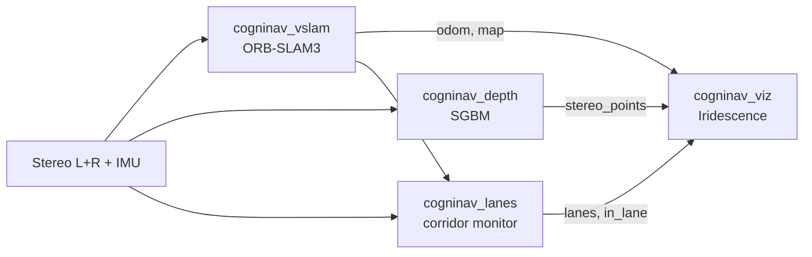

<p align="center">
  <strong style="font-size: 1.6em;">CogniNav</strong><br/>
  <em>Stereo visual SLAM and aisle guidance for warehouse AMRs</em>
</p>

<p align="center">
  <a href="https://github.com/jonathantyl97/CogniNav"></a>
  <a href="https://github.com/jonathantyl97/CogniNav"></a>
  <a href="https://github.com/jonathantyl97/CogniNav"></a>
  <a href="https://github.com/jonathantyl97/CogniNav"></a>
  <a href="https://github.com/jonathantyl97/CogniNav/blob/master/plan.md"></a>
</p>

---

**CogniNav** is a ROS 2 stack for autonomous mobile robots in **dynamic warehouses**: stereo ORB-SLAM3 localization, dense stereo depth, floor-line aisle detection, and in-corridor human/vehicle awareness. Visualization uses **[Iridescence](https://github.com/koide3/iridescence)** (desktop OpenGL), not Pangolin at runtime.

| Design choice | Policy |
|---------------|--------|
| Cameras | **Stereo pair only** (no monocular mode) |
| Primary ROS distro | **Jazzy** on Ubuntu 24.04 |
| SLAM core | [ORB-SLAM3](https://github.com/UZ-SLAMLab/ORB_SLAM3) (GPLv3), headless viewer |
| Dense depth | OpenCV `StereoSGBM` |
| Debug viewer | `cogninav_viz` + `pyridescence` |

---

## Architecture



**Typical flow:** stereo images feed SLAM and perception; SLAM pose anchors lane geometry; depth and detections highlight obstacles and movers in the aisle; Iridescence shows map, trajectory, depth, and markers in one window.

---

## ROS 2 packages

| Package | Role |
|---------|------|
| `cogninav_vslam` | ORB-SLAM3 wrapper (`orb_slam3_stereo`, `orb_slam3_stereo_inertial`) |
| `cogninav_depth` | Dense `/cogninav/stereo_points` from rectified stereo |
| `cogninav_lanes` | Floor lines + MobileNet-SSD corridor monitor |
| `cogninav_viz` | Iridescence viewer for map, odom, depth, lanes, dynamics |
| `cogninav_bringup` | Launch files and YAML configs |

### Key topics

| Topic | Message |
|-------|---------|
| `/cogninav/odom` | `nav_msgs/Odometry` |
| `/cogninav/map_points` | `sensor_msgs/PointCloud2` |
| `/cogninav/stereo_points` | `sensor_msgs/PointCloud2` |
| `/cogninav/lane_markers` | `visualization_msgs/MarkerArray` |
| `/cogninav/in_lane_markers` | `visualization_msgs/MarkerArray` |

---

## Quick start

### 1. Start the dev container

```bash
./docker/cogninav_jazzy.sh
```

Mounts the repo at `/root/cogninav`, enables GPU + X11 for Iridescence, and uses a **persistent** container (`ros2_jazzy_cogninav`).

### 2. Install dependencies (first time)

```bash
cd /root/cogninav
./scripts/setup_deps.sh    # ORB-SLAM3, Pangolin (compile-only), pyridescence
```

### 3. Build the workspace

```bash
cd /root/cogninav/ros2_ws
source /opt/ros/jazzy/setup.bash
colcon build
source install/setup.bash
```

### 4. Launch (perception + viz)

```bash
ros2 launch cogninav_bringup cogninav.launch.py
# Headless (no Iridescence window):
ros2 launch cogninav_bringup cogninav.launch.py use_viz:=false
```

### 5. Phase 0 smoke test

```bash
./scripts/smoke_euroc.sh --workspace-only
# Full EuRoC SLAM smoke (after downloading MH_01_easy):
./scripts/download_euroc.sh MH_01_easy
./scripts/smoke_euroc.sh
```

---

## Repository layout

```
CogniNav/
  docker/              # Jazzy / Humble container scripts + Dockerfile
  scripts/             # setup_deps, EuRoC download, smoke tests
  ros2_ws/src/         # ROS 2 packages
  benchmarks/          # eval harness + results/
  third_party/         # ORB_SLAM3 (cloned by setup_deps, not in git)
  plan.md              # Full roadmap and phase gates
```

---

## Roadmap

| Phase | Goal | Gate |
|-------|------|------|
| **0** | Docker + workspace + ORB build | `colcon build`, EuRoC smoke |
| **1** | EuRoC stereo-inertial SLAM + viz | ATE within 2x paper on 5+ sequences |
| **2** | TUM-VI + KITTI | Same wrapper, dataset configs |
| **3** | Humble parity | EuRoC smoke on 22.04 |
| **4** | Live stereo rig + warehouse bag | Open-dataset regression still passes |

Details: [`plan.md`](plan.md)

---

## Development

| Item | Notes |
|------|-------|
| Wrapper source | Adapted from [zang09/ORB_SLAM3_ROS2](https://github.com/zang09/ORB_SLAM3_ROS2) |
| Jazzy patches | `scripts/patch_orb_jazzy.sh` (OpenCV 4.6, GCC 13, C++17) |
| Datasets | [EuRoC MAV](https://projects.asl.ethz.ch/datasets/euroc-mav/), TUM-VI, KITTI (stereo only) |
| Evaluation | [evo](https://github.com/MichaelGrupp/evo) via `benchmarks/run_benchmark.sh` |

---

## License

- CogniNav ROS 2 packages: see per-package `package.xml` (Apache-2.0 / MIT / GPL-3.0 where noted).
- **ORB-SLAM3** and the vendored wrapper are **GPLv3**. Building and linking `libORB_SLAM3.so` triggers GPLv3 obligations for combined works.

---

<p align="center">
  <sub>CogniNav — navigate structured aisles with stereo SLAM in dynamic warehouses.</sub>
</p>
