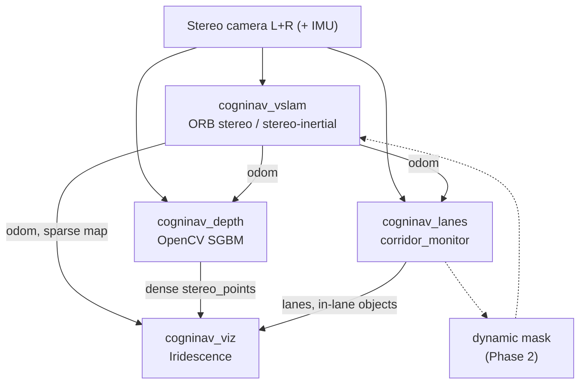

# CogniNav: Stereo SLAM for warehouse AMRs

> ORB-SLAM3 ROS 2 for **autonomous mobile robots** in **structured environments** (warehouses, aisles, floor guides).
> **Stereo cameras and stereo datasets only.**

**Target robot:** AMR / forklift-style platforms in **dynamic warehouses** — structured aisles **plus** moving people, vehicles, and pallets.

**Environment model:** **Structured layout** (lines, racks) + **dynamic actors** (not a static map).

Depth comes from two places:

| Source | Type | Node |
|--------|------|------|
| ORB-SLAM3 stereo triangulation | Sparse map landmarks | `cogninav_vslam` |
| OpenCV StereoSGBM | Dense depth point cloud | `cogninav_depth` |

---

## 1. Goal

Build a **stereo visual SLAM + aisle guidance** stack for warehouse AMRs:

| Pillar | What it does |
|--------|----------------|
| **ORB-SLAM3 (stereo)** | Robot pose + sparse map in the warehouse |
| **Stereo depth** | Nearby static obstacles + moving objects (dense cloud) |
| **Aisle / lane detection** | Floor lines → drivable corridor (static structure) |
| **Dynamic object detection** | Humans, forklifts, other AMRs — **in aisle and nearby** |
| **Dynamic-aware SLAM** | Do not lock movers into the permanent map (Phase 2) |
| **Aisle keeping** | Stay centered using line geometry + SLAM pose |
| **Iridescence** | Debug: map, depth, aisles, dynamic markers |

Warehouses are **dynamic spaces**: pickers, forklifts, pallets, doors opening. CogniNav treats dynamics as **first-class**, not an afterthought.

**Use case:** Robot follows aisles while **detecting movers**, slows or replans when someone enters the corridor, and builds a **static** SLAM map that ignores transient objects.

**Sensor policy:** Always a **stereo camera pair**. No monocular mode.

---

## 1b. Dynamic spaces (why this still matters for AMR)

| Dynamic actor | Risk | CogniNav response |
|---------------|------|---------------------|
| **Worker** in aisle | Collision, SLAM map corruption | Detect + mark in corridor; mask from ORB map |
| **Forklift / AMR** | Blockage, wrong loop closure | Detect as vehicle; in-aisle flag |
| **Pallet / cart** | Temporary obstacle | Depth + detection (extend classes later) |
| **Static racks / lines** | Navigation structure | Lanes + SLAM landmarks |

**Today (`corridor_monitor`):** MobileNet-SSD on left image → person / vehicle → **inside aisle corridor** → `/cogninav/in_lane_markers` + Iridescence.

**Next:** publish full-image dynamic boxes + mask for ORB; optional simple tracking across frames.

**Verification policy:** No phase complete without reproducible results in `benchmarks/results/`
on public datasets. Private warehouse rosbags are for dynamic-scene validation.

**Non-goals:**
- Highway / outdoor driving AD benchmarks as primary success metric
- Monocular SLAM, RGB-D-only pipelines
- DROID-SLAM, GLIM
- Full Nav2 / MPC stack (we publish constraints; planner is separate)

---

## 2. Dev environment (Docker)

Development runs in Docker on the host machine — **not** native on the host ROS install.

### Host machine

| Item | Value |
|------|--------|
| Machine | ROG Strix SCAR 16 |
| GPU | **RTX 5080 Laptop (~16 GB VRAM)** |
| ROS access | `~/humble.sh`, `~/jazzy.sh` |

ORB-SLAM3 is **CPU-bound**; the GPU is available for Iridescence (OpenGL), future perception, etc.

### Existing Docker scripts

| Script | Container | Image | Notes |
|--------|-----------|-------|-------|
| `~/humble.sh` | `ros2_humble_dev` | `osrf/ros:humble-desktop` | Persistent; mounts `~/pfr` → `/root/pfr` |
| `~/jazzy.sh` | `ros2_jazzy_5080` | `osrf/ros:jazzy-desktop-full` | `--gpus all`, `--rm`, X11 forwarding |

`ROS_DOMAIN_ID=100` on Humble (from `humble.sh`).

### CogniNav Docker strategy

| ROS distro | Role | Rationale |
|------------|------|-----------|
| **Jazzy** (primary) | Main build + ORB-SLAM3 ROS 2 port | Ubuntu 24.04, OpenCV 4.6, active ORB ROS 2 ports |
| **Humble** (secondary) | Compatibility / deployment target | Match robots still on 22.04 + Humble |

**Phase 0 deliverable:** extend the Jazzy container (or add `docker/cogninav_jazzy.sh`) to:

- Mount `~/OSS/CogniNav` → `/root/cogninav`
- Mount `~/Downloads` (datasets)
- Install ORB-SLAM3 build deps (Pangolin, Eigen, OpenCV dev, etc.)
- Persist the container (like Humble) once the base image is proven

Example mount to add to a CogniNav launch script:

```bash
-v ~/OSS/CogniNav:/root/cogninav \
-v ~/Downloads:/root/Downloads \
```

Build inside the container:

```bash
cd /root/cogninav
./scripts/setup_deps.sh    # ORB-SLAM3 + third_party
cd ros2_ws && colcon build
source install/setup.bash
```

---

## 3. Architecture



In plain language:

1. **Stereo ORB** localizes the robot in a repeating warehouse map.
2. **Aisle lines** (floor tape / paint) define left/right bounds and a **centerline**.
3. **Lane keeping:** compare robot pose to centerline → lateral + heading error → correction (`cmd_vel` or pose constraint).
4. **Depth + in-aisle detection** for forklifts and people in the corridor.
5. **Iridescence** for tuning in the lab before deploying on the AMR.

Design principles:

- **Stereo only** — left + right image topics (`/cam0`, `/cam1` or rig-specific names)
- **ROS 2** — Jazzy primary, Humble supported after Jazzy gate passes
- **Standard messages** — `nav_msgs/Odometry`, `geometry_msgs/PoseStamped`, TF,
  `sensor_msgs/PointCloud2` (map points)
- **Iridescence for visualization** — desktop OpenGL viewer; not Pangolin GUI, not RViz as primary
- **One SLAM node** per launch
- **Docker-first** — reproducible builds; pin dependency versions in `docker/`

---

## 4. Technology Stack

### 4.1 ORB-SLAM3 core
- Upstream: [UZ-SLAMLab/ORB_SLAM3](https://github.com/UZ-SLAMLab/ORB_SLAM3)
- Build `libORB_SLAM3.so` inside Docker from `third_party/ORB_SLAM3`
- License: **GPLv3**

### 4.2 ORB-SLAM3 — stereo modes only

| Mode | Use case | ORB setting |
|------|----------|-------------|
| **Stereo-inertial** (default) | TorWIC warehouse, live rig with IMU | `STEREO_INERTIAL` |
| **Stereo** | Stereo-only bags (no IMU) | `STEREO` |

Mono (`MONOCULAR`, `IMU_MONOCULAR`) is **out of scope**.

### 4.3 Stereo depth (`cogninav_depth`)

- OpenCV **StereoSGBM** on rectified left/right pair
- Publishes `/cogninav/stereo_points` (`sensor_msgs/PointCloud2` in `map` frame)
- Lightweight CPU; tunable `baseline_m`, intrinsics per dataset
- Later: use per-pixel depth for lane / dynamic 3D lifting (replace ground-plane hack)

### 4.4 ROS 2 wrapper (fork / harden one)
- `zang09/ORB_SLAM3_ROS2`
- `Robo-Dude/ROS2_ORB-SLAM3_Odometry` (Jazzy + Ubuntu 24.04)
- `EOLab-HSRW/orbslam3_ros2` (Humble-oriented)

Target: **Jazzy first** (`cv_bridge.hpp`, OpenCV 4.6, Pangolin 0.9.x).

### 4.5 Visualization — Iridescence (not Pangolin)

CogniNav does **not** use the Pangolin viewer at runtime.

| Component | Role |
|-----------|------|
| [Iridescence](https://github.com/koide3/iridescence) | Desktop OpenGL + ImGui viewer (`pyridescence`) |
| `cogninav_viz` | ROS 2 node: map points + camera trajectory → Iridescence window |

**ORB-SLAM3:** initialize with `bUseViewer = false`. Pangolin may still be required to **compile**
stock ORB-SLAM3; it is never shown. Optional later: [ORBSLAM3-NoPangolin](https://github.com/ran5515/ORBSLAM3-NoPangolin).

**Setup:**
1. X11 forwarding enabled (`docker/cogninav_jazzy.sh` sets `DISPLAY`)
2. `pip install pyridescence` (via `scripts/setup_deps.sh`)
3. `ros2 launch cogninav_bringup cogninav.launch.py`  
   Headless CI: `ros2 launch cogninav_bringup cogninav.launch.py use_viz:=false`

**ROS topics consumed by `cogninav_viz`:**

| Topic | Type |
|-------|------|
| `/cogninav/map_points` | `sensor_msgs/PointCloud2` |
| `/cogninav/odom` | `nav_msgs/Odometry` |

| `/cogninav/stereo_points` | dense depth `sensor_msgs/PointCloud2` |
| `/cogninav/lane_markers` | lane polylines |
| `/cogninav/in_lane_markers` | humans / cars in corridor |

### 4.6 Datasets — stereo only

No mono sequences in benchmarks. No TUM RGB-D.

### 4.7 Pinned dependencies (inside Docker)

| Dependency | Jazzy container | Humble container |
|------------|-----------------|------------------|
| Ubuntu | 24.04 (jazzy image) | 22.04 (humble image) |
| ROS 2 | Jazzy | Humble |
| OpenCV | 4.6 (system / libopencv-dev) | 4.5.x typical |
| Eigen | 3.4+ | 3.4+ |
| Pangolin | 0.9.x (compile-only for ORB-SLAM3) | 0.8–0.9.x |
| Iridescence | `pyridescence` (PyPI) | same |

---

## 5. Repository Structure

```
CogniNav/
  plan.md
  docker/
    cogninav_jazzy.sh       # launch script (extends jazzy.sh pattern)
    cogninav_humble.sh      # optional Humble dev
    Dockerfile.jazzy          # deps layer on osrf/ros:jazzy-desktop-full
  third_party/
    ORB_SLAM3/                # submodule
  ros2_ws/src/
    cogninav_bringup/       # launch files, warehouse + rig configs
    cogninav_vslam/         # ORB-SLAM3 ROS 2 wrapper (fork or vendored)
    cogninav_depth/         # stereo SGBM dense depth
    cogninav_lanes/         # lanes + in-corridor dynamic detection
    cogninav_viz/           # Iridescence: sparse map + dense depth + lanes + dynamics
  benchmarks/
    run_benchmark.sh
    eval_ate.py               # evo ATE/RPE
    configs/                  # per-sequence YAML + calib
    results/                  # committed JSON + plots
  scripts/
    setup_deps.sh             # build ORB-SLAM3 + pyridescence in container
    download_warehouse.sh     # TorWIC + NVIDIA r2b_storage
    smoke_warehouse.sh
    run_live_viz.sh
    record_rig_bag.sh
  benchmarks/
    run_benchmark.sh
    run_warehouse_slam.sh
    run_humble_smoke.sh
    run_regression_suite.sh
    eval_ate.py               # evo ATE/RPE
    configs/                  # per-sequence YAML + calib
    results/                  # committed JSON + plots
```

---

## 6. Open-Dataset Verification (required)

### 6.1 Benchmark datasets (SLAM development)

| Dataset | Role for AMR project |
|---------|----------------------|
| **TorWIC-SLAM** | Real Clearpath warehouse — primary regression |
| **NVIDIA r2b_storage** | Native ROS 2 storage/warehouse scene — fast CI smoke |
| **Own warehouse rosbag** | Live rig validation, dynamics, aisle keeping |

Excluded: mono sequences, highway/outdoor driving benchmarks as primary success metric.

### 6.2 Metrics ([evo](https://github.com/MichaelGrupp/evo))
- **ATE RMSE** (primary)
- **RPE** trans / rot
- **Success rate** (% sequences without tracking loss)
- **Runtime** (Hz)

### 6.3 Phase gates

| Phase | Gate | Status |
|-------|------|--------|
| **0** | Docker builds; `colcon build` succeeds; warehouse smoke | **Done** |
| **1** | TorWIC warehouse SLAM + viz | **Done** — `aisle_cw_run_1` trajectory smoke |
| **2** | Perception on warehouse replay | **In progress** — lanes + depth + dynamics on bag |
| **3** | Humble container: warehouse smoke passes (parity) | **Done** — workspace + trajectory in `ros2_humble_cogninav` |
| **4** | Own camera rig + rosbag; warehouse regression still passes | **Started** — `live.launch.py`, RealSense/ZED presets, record + regression scripts |

### 6.4 Reproducibility
- `benchmarks/run_benchmark.sh --dataset warehouse --seq aisle_cw_run_1`
- Commit results: `benchmarks/results/<date>_warehouse_<seq>.json`
- Record Docker image tag + git SHA in each result file

---

## 7. Phased Roadmap

### Phase 0 — Docker + workspace
- `docker/cogninav_jazzy.sh` (mount `~/OSS/CogniNav`, GPU, X11)
- `scripts/setup_deps.sh` — ORB-SLAM3 (headless) + pyridescence in container
- `cogninav_viz` ROS 2 package (Iridescence viewer)
- Fork/vend ORB-SLAM3 ROS 2 wrapper into `cogninav_vslam`
- `colcon build` in `ros2_ws`
- `benchmarks/run_benchmark.sh` skeleton + warehouse download script

### Phase 1 — Warehouse SLAM ✅

**Delivered:**
- `orb_slam3_node` — stereo-inertial SLAM, `/cogninav/odom`, `/cogninav/map_points`, TF, TUM trajectory on shutdown
- `warehouse.launch.py` + `r2b_storage.launch.py`; TorWIC + NVIDIA r2b configs; `benchmarks/run_warehouse_slam.sh`
- `cogninav_viz` — Iridescence 3D map + trajectory + in-window camera panel (`update_image`)
- Map point accumulation for denser visualization

**Verified:** TorWIC `aisle_cw_run_1` smoke — trajectory saved, benchmark JSON in `benchmarks/results/`.

### Phase 2 — Perception on warehouse replay 🔄 (in progress)

**Delivered:**
- `cogninav_depth`, `cogninav_lanes`, `cogninav_viz` on warehouse topic layout
- Compressed image republish in `warehouse.launch.py`

**Gate:** full stack runs on TorWIC bag replay with lanes + depth publishing.

**Next:** tune intrinsics in `orb_torwic_azure.yaml`; validate corridor monitor on warehouse movers.

### Phase 3 — Humble parity ✅

**Delivered:** `cogninav_humble.sh`, `patch_orb_humble.sh`, `sanitize_ros2_bag_for_humble.py`, `run_humble_smoke.sh`, `cv_bridge_compat.hpp`.

**Verified:** `colcon build` + warehouse trajectory smoke in `ros2_humble_cogninav`.

### Phase 4 — Live stereo rig 🔄 (in progress)

**Delivered:**
- `launch/live.launch.py` — rig preset selector (`realsense_d455`, `zed2`)
- `config/realsense_d455.yaml`, `config/zed2.yaml` — topics + depth/lane intrinsics
- `config/orb_realsense_d455.yaml`, `config/orb_zed2.yaml` — ORB settings templates (tune per unit)
- `scripts/run_live_viz.sh`, `scripts/record_rig_bag.sh`
- `benchmarks/run_regression_suite.sh` — warehouse SLAM after rig/calibration changes
- `docker/LIVE_RIG.md`

**Gate:** live SLAM initializes on rig; warehouse rosbag recorded; `./benchmarks/run_regression_suite.sh` passes.

**Next:** calibrate intrinsics/extrinsics from `camera_info`; USB passthrough for Docker; warehouse bag replay launch.

---

## 8. Key Risks

| Risk | Mitigation |
|------|------------|
| ORB-SLAM3 GPLv3 | Accept for OSS research; document license |
| ORB + OpenCV 4.6 on Jazzy | Follow known port patches (`cv_bridge.hpp`, CMake) |
| Docker vs host GPU driver | Use `nvidia-container-toolkit`; Jazzy script already has `--gpus all` |
| Pangolin / ORB build fragility | Pangolin compile-only; pin v0.9.2; viewer disabled; viz via Iridescence |
| `jazzy.sh` uses `--rm` (ephemeral) | Switch CogniNav to named persistent container once deps installed |
| Humble vs Jazzy drift | Jazzy first; Humble only after Phase 1 gate |

---

## 9. Immediate Next Steps

**Phase 4 (current):**
1. Install camera driver on host (`realsense2_camera` or `zed_ros2_wrapper`) — see `docker/LIVE_RIG.md`
2. `./scripts/run_live_viz.sh --rig realsense_d455` (or `zed2`)
3. Tune `config/orb_<rig>.yaml` from `camera_info`
4. `./scripts/record_rig_bag.sh --rig realsense_d455 --name warehouse_aisle1`
5. `./benchmarks/run_regression_suite.sh` after calibration edits

**Phase 2 (remaining):**
1. Run full stack on TorWIC bag: `ros2 launch cogninav_bringup warehouse.launch.py use_viz:=true`
2. Tune lane/depth params for warehouse lighting and floor lines

**Always:**
1. Start container: `./docker/cogninav_jazzy.sh`
2. Build: `cd ros2_ws && colcon build && source install/setup.bash`
3. Commit benchmark JSON to `benchmarks/results/` after each gate run

---

## 10. References

- ORB-SLAM3: [UZ-SLAMLab/ORB_SLAM3](https://github.com/UZ-SLAMLab/ORB_SLAM3)
- ROS 2 ports: `zang09/ORB_SLAM3_ROS2`, `Robo-Dude/ROS2_ORB-SLAM3_Odometry`, `EOLab-HSRW/orbslam3_ros2`
- ORB-SLAM3 on Jazzy/24.04: [HackMD guide](https://hackmd.io/@dennis40816/rJqjMi6tJe)
- Eval: [evo](https://github.com/MichaelGrupp/evo)
- Iridescence: [koide3/iridescence](https://github.com/koide3/iridescence)
- Warehouse data: [TorWIC-SLAM](https://github.com/Viky397/TorWICDataset), [NVIDIA r2b_storage](https://catalog.ngc.nvidia.com/orgs/nvidia/teams/isaac/resources/r2bdataset2023)

---

*CogniNav — stereo SLAM + aisle guidance for warehouse AMRs.*
